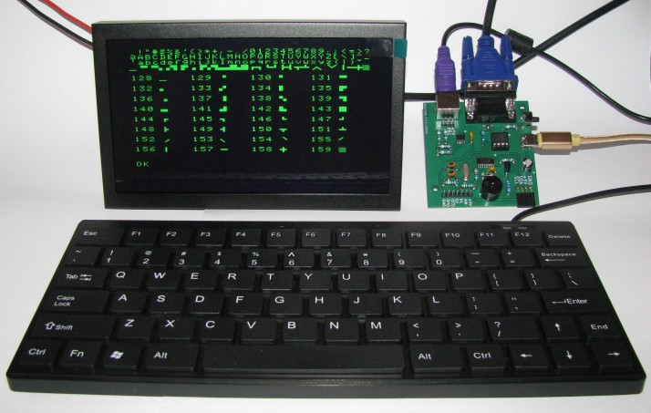

Microcomputer TinyBasRV
======================

The TinyBasRV microcomputer is a very simple device that even an electrical engineering beginner should be able to assemble and put into operation. It resembles simple 8-bit computers from the 1980s. After assembly, it can be programmed very easily using the Tiny BASIC language, which should be manageable even for those who have never programmed before. The basis is a small 32-bit RISC-V processor cooperating with serial I2C memory, where the user-created program is stored.

A microcomputer is suitable for the first introduction to computing technology when teaching hardware and software. It can be used not only for educational purposes, but can also be used as a control element for simple electronic devices.

Technical data for TinyBasRV
----------------------------

*   TinyBasHW_KiCad - HW documents (schematic and printed circuit board) in KiCad 9.0 format
*   src - Source files for TinyBasRV for CH32V003 created in MounRiver 2.10 environment
*   Bin - Compiled binary content in HEX format for direct loading into CH32V003 memory
*   Manuals - Manuals for HW, Tiny BASIC programming language and its examples and advice for beginners
*   EEPROM_examples - Contents of serial EEPROM memory in HEX format with examples of 8 ready-made Tiny BASIC sample programs for loading into microcomputer memory

Requirements for building and operating a TinyBasRV
---------------------------------------------------

*   Printed circuit board
*   Electrical components according to the list in the TinyBasHW manual
*   WCHLinkE programmer for programming CH32V003
*   Monitor with VGA input
*   Keyboard with PS2 connector
*   5V power supply

Using a microcomputer
---------------------

The assembled microcomputer only requires a 5 V power supply and a VGA monitor and PS2 keyboard connection. It is possible to use both a modern monitor and keyboard...

... so you can also create an old "retro" computer (if you can still find historical computer parts).

After debugging the program, the TinyBasRV microcomputer can work independently without a monitor and keyboard and control, for example, some LED lighting effects.

* * *

Mikropočítač TinyBasRV
======================

Mikropočítač TinyBasRV je velmi jednoduché zařízení, které by měl dokázat sestavit a uvést do provozu i elektrotechnický začátečník. Podobá se jednoduchým 8bitovým počítačům z 80tých let. Po sestavení jej lze velmi jednoduše programovat pomocí jazyka Tiny BASIC, který by měl zvládnout i ten, kdo dříve neprogramoval. Základem je malý 32bitový RISC-V procesor spolupracující se sériovou I2C pamětí, kam se ukládá uživatelem tvořený program.

Mikropočítač je vhodný pro první seznámení s výpočetní technikou při výuce technického i programového vybavení. Může být použit nejen pro výukové účely, ale lze jej nasadit jako řídicí prvek pro jednoduché elektronické přístroje.

Technické podklady pro TinyBasRV
--------------------------------

*   TinyBasHW_KiCad - HW podklady (schéma a plošný spoj) ve formátu programu KiCad 9.0
*   src - Zdrojové soubory k TinyBasRV pro CH32V003 vytvořené v prostředí MounRiver 2.10
*   Bin - Přeložený binární obsah ve formátu HEX pro přímé nahrání do paměti CH32V003
*   Manuals - Manuály pro HW, programovací jazyk Tiny BASIC a jeho příklady a rady pro začátečníky
*   EEPROM_examples - Obsah sériové EEPROM paměti ve formátu HEX s příklady 8 hotových ukázkových programů Tiny BASIC pro nahrání do paměti mikropočítače

Požadavky pro stavbu a provoz TinyBasRV
---------------------------------------

*   Deska plošného spoje
*   Elektrotechnické součástky podle seznamu v manuálu TinyBasHW
*   Programátor WCHLinkE pro naprogramování CH32V003
*   Monitor s VGA vstupem
*   Klávesnice s konektorem PS2
*   Napájecí zdroj 5 V

Použití mikropočítače
---------------------

Sestavený mikropočítač vyžaduje pouze napájecí zdroj 5 V a připojení VGA monitoru a PS2 klávesnice. Je možné použít jak moderní monitor a klávesnici...

... tak si vytvořit i starý "retro" počítač (pokud ještě najdete dnes již historické počítačové díly).

Po odladění programu, může mikropočítač TinyBasRV pracovat samostatně bez monitoru a klávesnice a řídit např. nějaké světelné LED efekty.

